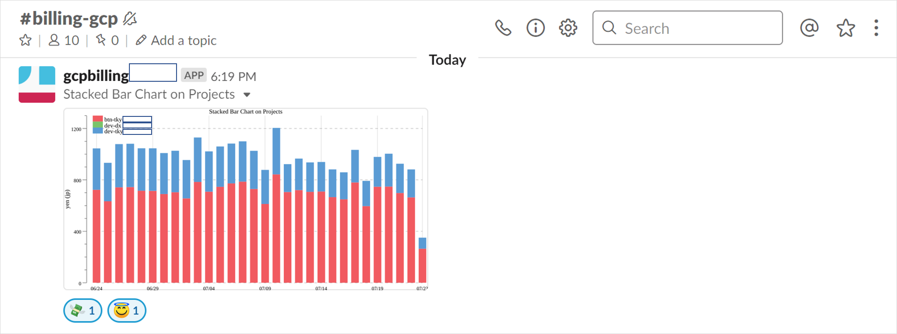

# gbilling-plot


Create graphed invoice for Google Cloud Platform. You can see billing amount per GCP project.

## Usage

This package uses below great services.

- Google Cloud Billing（BigQuery）
- Google Cloud Functions
- Google Cloud Pub/Sub
- Google Cloud Scheduler
- Slack API

## QuickStart

1. Install
    ```console
    go get -u go get -u github.com/future-architect/gbilling-plot/cmd/gbplot
    ```
2. Obtain GCP Service credentials that must have `bigquery.jobs.create` permission
    ```bash
    export GOOGLE_APPLICATION_CREDENTIALS=<credentials path>
    ```
3. Export your GCP billing to BigQuery
    * https://cloud.google.com/billing/docs/how-to/export-data-bigquery
4. Run command
    ```bash
    gbplot -project <your project name> -table <your billing table name on bigquery> -out out.png
    ```
5. You can confirm out.png file

## Options

```console
$ gbplot --help
Usage of gbplot:
  -o string
        Output file name (default "out.png")
  -out string
        Output file name (default "out.png")
  -p string
        GCP project name
  -project string
        GCP project name
  -t string
        BigQuery billing table name
  -table string
        BigQuery billing table name
```

## Deploy Google Cloud Function 

### Requirements

* [Go](https://golang.org/dl/) more than 1.11
* [Cloud SDK](https://cloud.google.com/sdk/install/)

### Steps

1. [Get Slack API Token](https://get.slack.help/hc/en-us/articles/215770388-Create-and-regenerate-API-tokens)
2. [Export your GCP billing to BigQuery](https://cloud.google.com/billing/docs/how-to/export-data-bigquery)
3. Create Cloud Scheduler
    ```sh
    gcloud beta scheduler jobs create pubsub graph-billing --project "<your project name>" \
      --schedule "50 23 * * *" \
      --topic graph-billing \
      --message-body="execute" \
      --time-zone "Asia/Tokyo" \
      --description "This is scheduler for graph billing."
    ```
4. Deploy to Cloud Function
    ```sh
    git clone https://github.com/future-architect/gbilling-plot.git
    cd gbilling-plot
    gcloud functions deploy graphBilling --project "<your project name>" \
      --entry-point GraphedBilling \
      --triggerz-resource graph-billing \
      --trigger-event google.pubsub.topic.publish \
      --runtime go111 \
      --set-env-vars TABLE_NAME="<your billing table name on bigquery>" \
      --set-env-vars SLACK_API_TOKEN="<your slack api token>" \
      --set-env-vars SLACK_CHANNEL="<your slack channel name>"
    ```
5. Go to the [Cloud Scheduler page](https://cloud.google.com/scheduler/docs/tut-pub-sub) and click the *run now* button of *graphBilling*

## Example

Sample output is below.



## License

This project is licensed under the Apache License 2.0 License - see the [LICENSE](LICENSE) file for details
